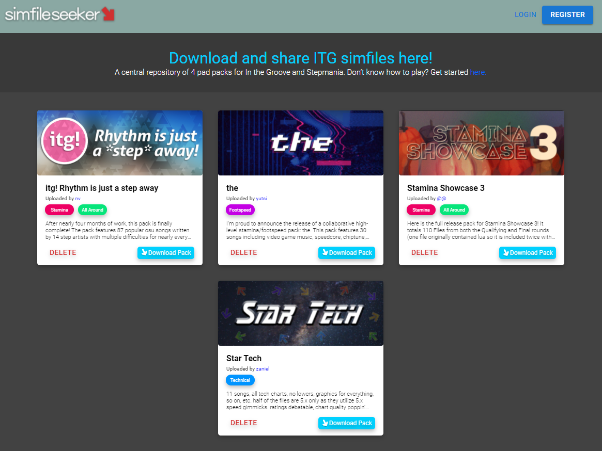

# Simfile Seeker
## A website for finding pad sims quick & easily.

Write-up: https://docs.google.com/document/d/1O6RBPoQojnP9kBA6iOS6MxRWgj9FZNezi6O07wKNjU4/edit?usp=sharing

 

## Quick start
1. Create `.env` and add your `ATLAS_URI`
2. npm install everything (duh)
3. `npm run backend` to start the Express server. It should start running on port 5000.
4. `npm run backend` to start the React server. It should start on port 3000.
5. It hopefully runs.